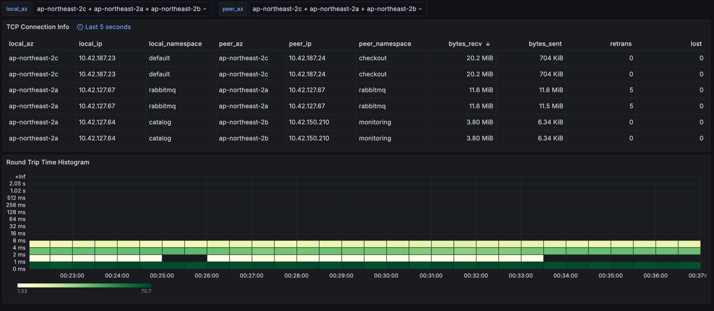

# ebpf-exporter를 활용한 AWS EKS 네트워크 모니터링

## 프로젝트 설명
https://lunalight.im/2024/05/03/monitoring-eks-network-with-ebpf.html

## Dashboard
Sample Dashboard: http://grafana.lunalight.im/d/cdkisx46nhh4wb/8-pod-tcp-connection-info?orgId=1

username: guest  
password: guest



## How to Deploy
이 코드가 테스트된 환경 정보는 아래와 같습니다. 환경이 다를 경우 실행이 원활하지 않을 수도 있습니다.
```
k8s
 - Client: v1.29.0
 - Server: v1.29.3-eks-adc7111
Node
 - OS: Amazon Linux 2
 - Kernel: 5.10.205-195.807.amzn2.x86_64
```

소스 코드를 다운 받습니다.
```shell
git clone https://github.com/MoonHyuk/ebpf_exporter.git
cd ebpf_exporter
```

필요한 helm repo를 추가합니다. 이 대시보드는 `prometheus-community/kube-prometheus-stack`과 `kubeservice-stack/kubeservice-ebpf-exporter` 차트를 사용합니다.
```shell
helm repo add prometheus-community https://prometheus-community.github.io/helm-charts
helm repo add kubeservice-stack https://kubeservice-stack.github.io/kubservice-charts
helm repo update
```

monitoring 네임스페이스를 생성하고, 해당 네임스페이스의 default ServiceAccount에 pods와 nodes를 읽을 수 있는 권한을 부여합니다.
```bash
kubectl apply -f clusterrole.yaml
```

helm 차트를 설치합니다.
```bash
helm install ebpf-exporter kubeservice-stack/kubeservice-ebpf-exporter -n monitoring -f ebpf-exporter-values.yaml
helm install kube-prometheus prometheus-community/kube-prometheus-stack -n monitoring -f prometheus-values.yaml
```

기본으로는 사전에 빌드한 이미지 (moonhyuk/ebpf-tcp-exporter:lastest)를 사용합니다.
만약 수정된 소스 코드로 직접 빌드하고 싶으시다면 아래 명령어로 빌드한 후,
```shell
docker build --tag <IMAGE_REPO:IMAGE_TAG> --target ebpf_exporter_with_examples .
docker push <IMAGE_REPO:IMAGE_TAG>
```

`ebpf-exporter-values.yaml` 파일을 수정합니다.
```yaml
image:
  # Docker image pull policy.
  pullPolicy: Always
  # Docker image registry.
  registry: <REGISTRY>
  # Docker image repository.
  repository: <IMAGE_REPO>
  tag: <IMAGE_TAG>
```
